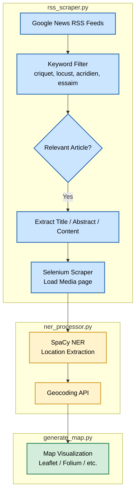
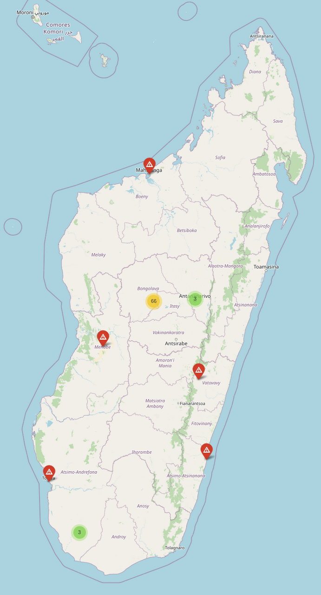

# Locust invasion Tracker - Madagascar

Display a map that plot articles metadata dealing with Locust invasion.

## Pipeline 
1. Source of data: Google News aggregator (RSS flux)
2. Filter only relevant articles based on the two keyword list: 

    ```{python}
        self.thematic_keywords = [
            # Français
            "criquet", "criquets", "acridien", "invasion", "essaim",
            # English
            "locust", "locusts", "swarm", "outbreak",
            # Malagasy (approximations courantes)
            "valala", "andiam-balala", "kijeja", "zana-balala",
        ]

        self.geo_keywords = [
            # Country
            "madagascar", "madagaskar", "malagasy", "malgache", "madagasikara",

            # Old province
            "antananarivo", "antsiranana", "mahajanga", "toliara", "tuléar", "fianarantsoa", "toamasina", "tamatave",

            # States / provinces
            "atsimo-andrefana", "androy", "anôsy", "menabe", "melaky",
            "boeny", "sofia", "diana",
            "amoron'i mania", "haute matsiatra", "vatovavy fitovinany",
            "atsinanana", "analanjirofo",
            "itasy", "vakinankaratra", "alaotra-mangoro", "bongolava",
        ]
    ```
3. With SpaCy extract location found in Title/abstract of new article
4. Load Media pages and extrant web content
5. Extract location from web content
6. Display on map



## See results

Connect to [[website](https://remydecoupes.github.io/locust-invasion-tracker/)]

<p align="center">
  
  <br>
  <em>Fig. 1 - Overview of the Madagascar map with localized articles</em>
</p>

## Feature Tracking

| Date       | Feature / Change Added            | Description                                         | Impact on Data Coverage                          |
|------------|-----------------------------------|-----------------------------------------------------|--------------------------------------------------|
| 2026-02-06 | Extended geographic keyword list  | Added additional geographic keywords for Madagascar | +4 news articles collected (from 2424.mg ), +10 new locations identified |
| YYYY-MM-DD | Parse RSS flux in Malagasy        |                                                     |                                                  |
| YYYY-MM-DD | Map: display both polygon and points |                                                     |                                                  |


## Disclaimer & Intended Use

These scripts use **Selenium** to scrape content from **Google News search results**.

They are provided **strictly for educational and research purposes**, with the sole objective of demonstrating:
- how web automation and scraping tools work,
- and how information can be gathered and analyzed from press and news sources.

These scripts are **not intended for production use**.

**Do not use these scripts in production or at scale.**  
Automating access to Google News and scraping content from indexed websites may violate:
- Google’s Terms of Service,
- the Terms of Use of the websites being scraped,
- and potentially applicable laws or regulations.

If you need to collect news data for a real-world application, you should rely on:
- official APIs (e.g. Google News via third-party APIs, news aggregators),
- licensed data providers,
- or explicit permission from content owners.

By using or modifying these scripts, you acknowledge that you are responsible for complying with all applicable terms, conditions, and legal requirements.